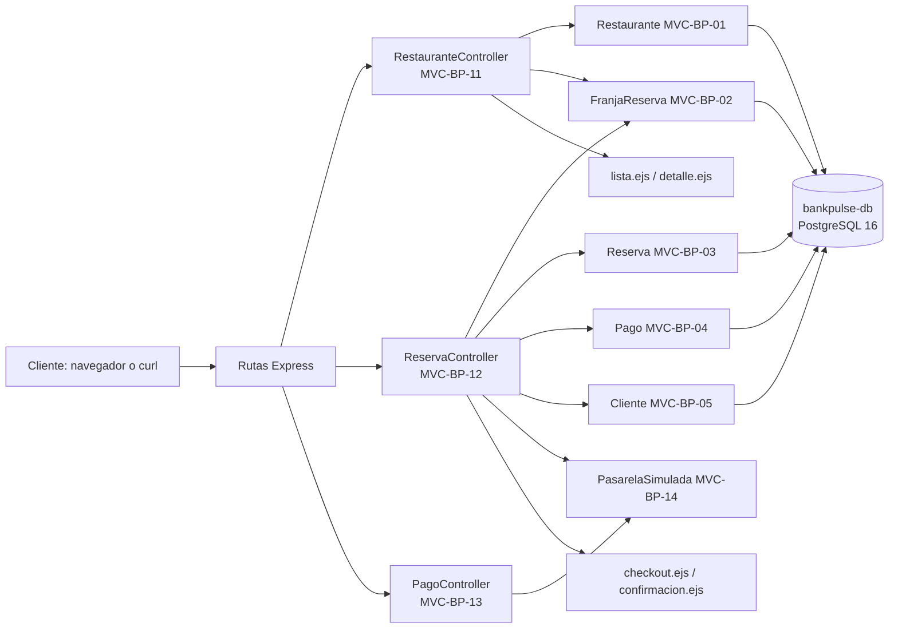

# BANKPULSE

BANKPULSE es el proyecto integrador de aplicación de pagos y beneficios (dominio financiero). Este repositorio contiene el esqueleto ejecutable del Sprint 1 (SPR-BP-01): descubrir restaurantes cercanos, filtrar franjas disponibles, reservar con compra (autorización de pago simulada) y recibir una confirmación digital.

Documento de diseño asociado: *Value Recovery Journey* (Diseño de Sistemas, USFQ). Los IDs de este README (INC, HU, MVC, PR, SVC, PRB) son los mismos de la matriz de trazabilidad del documento.

## 1. Propósito y alcance

- **Incluye:** Épica 1 (INC-BP-01) a nivel MVP: HU-BP-01 a HU-BP-04, sobre un entorno Docker reproducible.
- **No incluye:** Pasarela de pago real, datos de tarjeta (solo tokens de prueba), app móvil, Épicas 2, 3 y 4 (están en el backlog del documento de diseño).

## 2. Stack y versiones

| Componente | Versión |
|---|---|
| Node.js | 20 (imagen `node:20-alpine`) |
| Express | 4.x |
| EJS (Vistas) | 3.x |
| PostgreSQL | 16 (imagen `postgres:16-alpine`) |
| Docker Compose | v2 (plugin `docker compose`) |

Arquitectura MVC: rutas Express → Controlador → Modelo (SQL parametrizado con `pg`) → Vista EJS (o JSON si la cabecera `Accept` es `application/json` o se agrega `?formato=json`).

## 3. Requisitos previos

- Docker Desktop (o Docker Engine con Compose v2) o GitHub Codespaces.
- Git. Node.js 20 solo es necesario si quiere ejecutar `scripts/smoke.js` desde el host (no hace falta si usa `docker compose exec`).
- Puerto libre `3001` en el host.

## 4. Configuración de variables de entorno

```bash
cp .env.example .env        # PowerShell: Copy-Item .env.example .env
```

| Variable | Valor de ejemplo | Descripción |
|---|---|---|
| `API_PORT` | `3001` | Puerto del host donde se publica la API (dentro del contenedor es 3000) |
| `DB_NAME` | `bankpulse` | Nombre de la base de datos |
| `DB_USER` | `bankpulse_user` | Usuario de la base de datos |
| `DB_PASSWORD` | `cambiar_en_local` | **Obligatoria.** Cambie el valor en su `.env` local; el archivo `.env` nunca se sube al repositorio |

## 5. Levantar, probar y detener el entorno

```bash
docker compose up --build -d     # construir y levantar bankpulse-api y bankpulse-db
docker compose ps                # estado de los servicios (bankpulse-db debe quedar "healthy")
docker compose logs -f bankpulse-api     # logs de arranque
curl http://localhost:3001/health
docker compose down              # detener (conserva los datos)
docker compose down -v           # detener y borrar el volumen bankpulse_pgdata (vuelve a cargar la semilla)
```

Servicios y puertos:

| ID | Servicio | Puerto host | Notas |
|---|---|---|---|
| SVC-BP-01 | `bankpulse-api` | `3001` → 3000 | API Express; espera a que la base de datos esté saludable (`depends_on` con `service_healthy`) y además reintenta la conexión al arrancar |
| SVC-BP-02 | `bankpulse-db` | no publicado | PostgreSQL con el volumen `bankpulse_pgdata`; `db/init.sql` crea el esquema y los datos semilla solo la primera vez |

## 6. Endpoint de salud y operaciones demostrables

`GET /health` responde HTTP 200 con `{"estado":"ok","servicio":"bankpulse-api","base_de_datos":"ok"}` (503 si la base de datos no responde).

| Método | Ruta | Controlador | Historia |
|---|---|---|---|
| GET | `/health` | `SaludController.estado` | TEC-BP-02 |
| GET | `/restaurantes?lat=&lng=&radio_km=` | `RestauranteController.listarCercanos` | HU-BP-01 |
| GET | `/restaurantes/:id/franjas?fecha=YYYY-MM-DD&hora=HH:MM` | `RestauranteController.listarFranjas` | HU-BP-02 |
| POST | `/reservas` | `ReservaController.crear` | HU-BP-03 |
| GET | `/reservas/:codigo` | `ReservaController.obtenerPorCodigo` | HU-BP-04 |
| POST | `/pagos/autorizar` | `PagoController.autorizar` | HU-BP-03 |

Ejemplos:

```bash
# 1) Salud
curl http://localhost:3001/health

# 2) HU-BP-01: restaurantes a menos de 5 km de la Mariscal (Quito), ordenados por distancia
curl -H "Accept: application/json" "http://localhost:3001/restaurantes?lat=-0.18&lng=-78.48&radio_km=5"

# 3) HU-BP-02: franjas con cupo para una fecha futura (ajuste la fecha: la semilla cubre 120 días desde la creación de la base)
curl -H "Accept: application/json" "http://localhost:3001/restaurantes/1/franjas?fecha=2026-12-05&hora=19:00"

# 4) HU-BP-03: reservar con compra (cambie clave_idempotencia en cada reserva nueva)
curl -X POST http://localhost:3001/reservas -H "Content-Type: application/json" -H "Accept: application/json" \
  -d '{"cliente_id":1,"franja_id":1,"comensales":2,"token_pago":"tok_demo","clave_idempotencia":"demo-0001-abcd"}'

# 5) HU-BP-04: confirmación digital (use el codigo_confirmacion devuelto en el paso 4)
curl -H "Accept: application/json" http://localhost:3001/reservas/BP-XXXXXX
```
En Windows PowerShell use `curl.exe` o, más simple, ejecute las pruebas automáticas (sección siguiente). En el navegador: <http://localhost:3001/restaurantes>.

Para provocar un rechazo use `"token_pago":"tok_rechazado"` (responde 402 y no descuenta cupo).

## 7. Pruebas

```bash
docker compose exec bankpulse-api node scripts/smoke.js all
```

Secciones: `health`, `hu01`, `hu02`, `hu03`, `hu04`. Cada prueba imprime `PASS` o `FAIL` por criterio de aceptación (CA) y termina con código distinto de cero si algo falla. Desde el host: `BASE_URL=http://localhost:3001 node scripts/smoke.js all`.

## 8. Estructura de carpetas

```
bankpulse-app/
├── Dockerfile · docker-compose.yml · .env.example · .dockerignore · .gitignore
├── package.json · package-lock.json
├── db/init.sql                      # esquema y datos semilla
├── scripts/smoke.js                 # pruebas PRB-BP-xx
├── .github/pull_request_template.md
└── src/
    ├── app.js · config/db.js · routes/index.js
    ├── controllers/  SaludController, RestauranteController, ReservaController, PagoController
    ├── models/       Restaurante, FranjaReserva, Reserva, Pago, Cliente
    ├── services/     PasarelaSimulada
    └── views/        restaurantes/{lista,detalle}.ejs · reservas/{checkout,confirmacion}.ejs
```

## 9. Arquitectura



El diagrama completo, con la justificación de diseño, está en el documento de diseño (capítulo de arquitectura MVC).

## 10. Trazabilidad del Sprint 1

| Historia | MVC | PR | Prueba |
|---|---|---|---|
| HU-BP-01 | MVC-BP-01, 06, 11 | PR-BP-02 | PRB-BP-01 |
| HU-BP-02 | MVC-BP-02 (en PR-BP-01), 07, 11 | PR-BP-02 | PRB-BP-02 |
| HU-BP-03 | MVC-BP-02, 03, 04, 05, 08, 12, 13, 14 | PR-BP-03 | PRB-BP-03 |
| HU-BP-04 | MVC-BP-03, 09, 12 | PR-BP-03 | PRB-BP-04 |

## 11. Flujo de trabajo en Git (GitHub Flow)

- `main` siempre debe levantar con `docker compose up --build`.
- Cada cambio entra por una rama `feature/<ID>-<descripción>` (por ejemplo `feature/HU-BP-01-02-busqueda-restaurantes`) y un Pull Request con la plantilla de `.github/pull_request_template.md`.
- Commits: `<tipo>(<ID>): <descripción en imperativo>`, por ejemplo `feat(HU-BP-01): ...`.
- Todo PR necesita la revisión de otro integrante antes de fusionarse (merge commit).
- Orden: primero se fusiona el PR-01 (esqueleto); después el PR-02 y el PR-03 pueden fusionarse en cualquier orden. Mientras un PR de historias no esté fusionado, su ruta responde `501 Pendiente de implementar`.

## 12. Solución de problemas frecuentes

- **`DB_PASSWORD` is required / «Defina DB_PASSWORD»:** falta el archivo `.env`; ejecute `cp .env.example .env`.
- **`port is already allocated`:** otro programa usa el puerto `3001`; cambie `API_PORT` en `.env` y vuelva a ejecutar `docker compose up -d`.
- **La API reinicia o dice «no disponible (intento n/30)»:** la base de datos aún arranca; espere unos segundos y revise `docker compose logs bankpulse-db`.
- **Cambié `db/init.sql` y no veo los cambios:** el script solo corre al crear el volumen; ejecute `docker compose down -v` y levante de nuevo.
- **`password authentication failed`:** cambió `DB_PASSWORD` después de crear el volumen; ejecute `docker compose down -v`.
- **Reserva responde 400 «clave_idempotencia»:** cada reserva nueva necesita una clave distinta de 8 a 100 caracteres.
- **`franjas` responde 400 «fecha no puede ser pasada» o lista vacía:** la semilla genera 120 días desde la fecha en que se creó el volumen; use una fecha futura dentro de ese rango o recree el volumen.
- **Codespaces:** abra la pestaña *Ports* y confirme que el puerto `3001` está publicado antes de abrir la URL.
- **No hay secretos en el repositorio:** `.env` está en `.gitignore`; solo se versiona `.env.example`.
